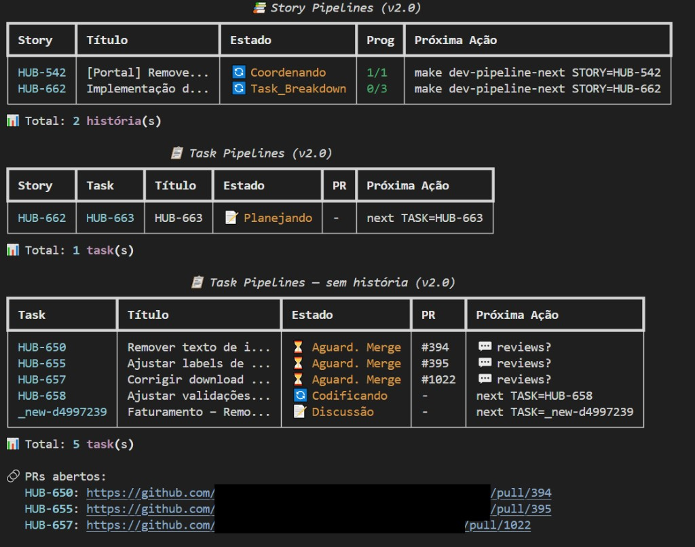
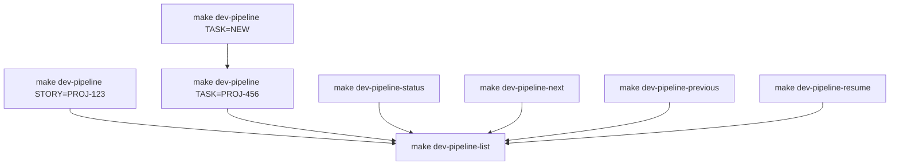

# ai-dev-pipeline

> **From Jira ticket to open PR — orchestrated, persistent, and safe.**



---

## Background

In early 2026, two thirds of the engineering team at the fintech where I work was let go overnight. A small team was left responsible for 9 active repositories across 4 products. The problem wasn't workload — it was context switching. Every new task meant re-reading unfamiliar code, re-planning from scratch, and manually coordinating every step of delivery across repos with different conventions.

I built this pipeline to solve that. I built and presented it in about a week, without dropping my normal delivery work. It's been running in production delivery since and has expanded to handle bug flows and multi-repo work simultaneously. Engineers who weren't heavy AI users adopted it organically — because it was predictable and safe, not just powerful.

---

## Why Not Just Use Cursor Agent Directly?

Cursor Agent is powerful but stateless. Every session starts cold, re-reads the codebase, and makes decisions without memory of what came before. For a full delivery lifecycle across multiple repositories, that breaks down in four ways:

- **No memory between sessions** — context is rebuilt from scratch every time
- **Unconstrained scope** — with live Jira and GitHub integrations, a hallucinating agent can close the wrong PR, delete tasks, or push to the wrong branch
- **No trace of past decisions** — why something was built a certain way is lost when the session ends
- **Expensive context reconstruction** — re-reading the entire codebase at every step is slow and burns tokens unnecessarily

Unlike prompt templates or rule files, this pipeline maintains persistent state across sessions and enforces human checkpoints before anything ships.

---

## How It Works

**Why scoped skills instead of broad context files?**

Context files give the agent more analytical freedom — it can reason across the whole problem. Skills constrain each step to a defined scope. The decision was architectural:

- **Safety**: live Jira and GitHub integrations mean a hallucinating agent has real consequences. Scoped skills can't act outside their boundary.
- **Token cost**: persistent output files mean each skill picks up exactly where the previous one left off — no re-reading the codebase from scratch.
- **Institutional memory**: the final documentation skill saves to the doc repository. Next time someone works on a related feature, they give the agent the doc file instead of re-reading all the code.

The pipeline is orchestrated by **12 Cursor Agent skills** (`@pipeline-*`), each responsible for one step of the delivery lifecycle. Skills write their outputs to standardized file paths — for example, the story analyzer writes `.story-plan.md` and the task planner reads it directly without re-analyzing the codebase. The orchestrator reads those outputs, persists state, and advances the flow.

### Story pipeline


### Task pipeline


### Commands and transitions



---

## Skills Reference

For full input/output details and examples, see [skills\README.md](skills/README.md).

> ⚠️ Always use `@pipeline-*` skills during the flow. The original `@skill-*` skills do not follow the orchestrator's output conventions.

| Skill | Purpose |
|-------|---------|
| `pipeline-story-analyzer` | Full story analysis + decisions and initial plan |
| `pipeline-story-planner` | Strategic planning for the story flow |
| `pipeline-task-breaker` | Breaks the story into proposed tasks |
| `pipeline-task-definer` | Defines/refines a task when `TASK=NEW` |
| `pipeline-task-planner` | Task execution plan (steps, risks, validations) |
| `pipeline-plan-validator` | Validates and improves plans in rounds |
| `pipeline-review-backend` | Backend code review (checklist + suggestions) |
| `pipeline-review-frontend` | Frontend code review (checklist + suggestions) |
| `pipeline-review-documentation` | Technical documentation review (structure, clarity, completeness) |
| `pipeline-pr-responder` | Processes review comments and generates a response plan |
| `pipeline-pr-updater` | Applies changes (commit/push) and updates PR |
| `pipeline-create-technical-docs` | Consolidates and generates final technical documentation |

---

## Requirements

| Requirement | Version | Notes |
|-------------|---------|-------|
| Python | 3.12+ | Required for orchestrator |
| Node.js | 18+ | Required for MCP integrations (optional) |
| Cursor IDE | Latest | Agent mode required |
| Git | Any recent | Required |
| GitHub CLI (`gh`) | Any recent | Only if `integrations.github.enabled=true` |

---

## Quick Start

### macOS / Linux

```bash
# 1. Install dependencies
python3 -m venv venv
source venv/bin/activate
pip install -r requirements.txt -r requirements-dev.txt

# 2. Configure
cp .pipeline-config.example.json .pipeline-config.json
cp .env.modelo .env
# Edit .pipeline-config.json to enable/disable integrations
# Edit .env only for integrations you enabled

# 3. Install Cursor skills
bash scripts/sync-skills.sh

# 4. Verify
make dev-pipeline-list
```

### Windows

<details>
<summary>Windows setup (Git Bash / PowerShell)</summary>

**PowerShell:**

```powershell
python -m venv venv
venv\Scripts\python -m pip install --upgrade pip
venv\Scripts\python -m pip install -r requirements.txt -r requirements-dev.txt
```

**Git Bash:**

```bash
source venv/Scripts/activate
```

> If `make` is not available, install via MSYS2 and ensure `/c/msys64/usr/bin` is in your Git Bash `PATH`.

Then follow steps 2–4 from the macOS/Linux instructions above.

</details>

---

## Configuration

Create `.pipeline-config.json` from the example template. All integrations are **disabled by default** — enable only what you need.

```json
{
  "integrations": {
    "jira": { "enabled": false },
    "github": { "enabled": false },
    "dynamodb": { "enabled": false }
  }
}
```

| Variable | Required when |
|----------|--------------|
| `JIRA_EMAIL`, `JIRA_API_TOKEN`, `JIRA_SERVER` | `integrations.jira.enabled=true` |
| `GITHUB_TOKEN`, `GITHUB_ORG` | `integrations.github.enabled=true` |
| `AWS_REGION`, `DYNAMODB_TABLE`, `AWS_*` | `integrations.dynamodb.enabled=true` |

> Never commit `.env` or `.pipeline-config.json`. Both are gitignored. Use `.pipeline-config.example.json` and `.env.modelo` as templates.

---

## Usage

```bash
# Start a story pipeline
make dev-pipeline STORY=PROJ-123

# Start a task pipeline
make dev-pipeline TASK=PROJ-456

# Create a new standalone task
make dev-pipeline TASK=NEW

# Create a new task linked to a story
make dev-pipeline TASK=NEW STORY=PROJ-123

# Navigate and manage state
make dev-pipeline-resume TASK=PROJ-456
make dev-pipeline-next TASK=PROJ-456
make dev-pipeline-previous TASK=PROJ-456
make dev-pipeline-status TASK=PROJ-456

# List all active pipelines
make dev-pipeline-list

# Help
make dev-pipeline-help
```

---

## Optional: MCP Servers

You can integrate with MCP servers for richer context during pipeline steps. This is a global Cursor setting and is not required.

- **Atlassian MCP** — allows the story analyzer and task planner to read Jira issues directly
- **Figma MCP** — allows the story analyzer to read design specs directly from Figma files

Example `~/.cursor/mcp.json`:

```json
{
  "mcpServers": {
    "atlassian": {
      "url": "https://mcp.atlassian.com/v1/mcp",
      "type": "http"
    },
    "figma": {
      "command": "npx",
      "args": ["-y", "figma-developer-mcp", "--figma-api-key=YOUR_FIGMA_TOKEN", "--stdio"]
    }
  }
}
```

---

## State and Output Conventions

Persistent state is stored under `pipelines/` (gitignored). Key output paths:

**Story:**
- `pipelines/stories/{story_key}/.story-plan.md`
- `pipelines/stories/{story_key}/.tasks-proposed.json`

**Task:**
- `pipelines/tasks/{task_key}/.plan.md`
- `pipelines/tasks/{task_key}/.review-report.md`
- `pipelines/tasks/{task_key}/.pr-response-plan.md`

---

## Extending the Pipeline

This pipeline is designed to be extended. To add to it:

- **New skill** — add a `.md` skill file under `skills/` following the existing naming convention (`pipeline-*`). Run `bash scripts/sync-skills.sh` to install it in Cursor. Document inputs, outputs, and expected file paths in [skills\README.md](skills/README.md).
- **New integration** — add a feature flag under `integrations` in `.pipeline-config.example.json`, implement the integration under `operations/`, and gate it with `config.integrations.<name>.enabled`.
- **New pipeline step** — add the step to the orchestrator in `pipelines/` and create the corresponding skill. Follow the existing output path convention so state persists correctly.

---

## Repository Structure

```
cli/           — CLI entry point
core/          — state persistence, logging, constants
operations/    — integrations (git, jira, github, etc.)
pipelines/     — story/task pipeline orchestration
utils/         — config, paths, validators, helpers
skills/        — Cursor Agent Skills per step
docs/          — guides and project documentation
scripts/       — skill sync/install scripts
tests/         — unit and integration tests
logs/          — logs (gitignored)
```

---

## Quality

```bash
# Run tests
python -m pytest -q

# Format and lint
make format
make lint
```

---

## Troubleshooting

| Problem | Fix |
|---------|-----|
| `make: command not found` (Windows) | Install `make` via MSYS2, add `/c/msys64/usr/bin` to Git Bash `PATH` |
| `ModuleNotFoundError` | Confirm correct venv is active: `python -c "import sys; print(sys.executable)"` |
| Jira/GitHub credential errors | Only configure `.env` for integrations enabled in `.pipeline-config.json` |
| Skills not found in Cursor | Run `bash scripts/sync-skills.sh` again after any `git pull` |

---

## Documentation

- **Full guide:** `docs/DEV-PIPELINE-GUIDE.md`
- **Skills reference:** [skills\README.md](skills/README.md)

---

## License

MIT — see [LICENSE](LICENSE).

---

If this approach to AI-native development resonates, consider starring the repo ⭐
