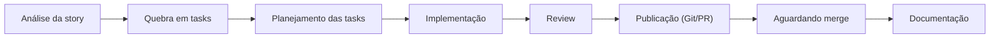
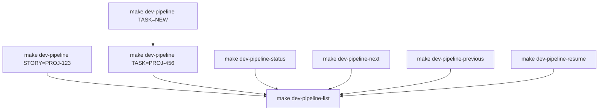

# dev-pipeline

Orquestrador de **pipeline de desenvolvimento** para Cursor Agents: transforma uma *story* (ou uma *task*) em uma sequência guiada e persistente de etapas (análise → planejamento → implementação → revisão → publicação → documentação), com integrações **opcionais** (Jira/GitHub/MCP/Figma/DynamoDB).

> **Objetivo**: reduzir o “custo de coordenação” do desenvolvimento, padronizar o fluxo e manter rastreabilidade do que foi feito em cada etapa.

## Sumário

- [Por que esse projeto existe?](#por-que-esse-projeto-existe)
- [Principais features](#principais-features)
- [Diagramas (fluxos v2.0)](#diagramas-fluxos-v20)
- [Skills do pipeline (Cursor Agent Skills)](#skills-do-pipeline-cursor-agent-skills)
- [Stack / Requisitos](#stack--requisitos)
- [Quickstart](#quickstart)
- [Uso (comandos principais)](#uso-comandos-principais)
- [(Opcional) MCP Servers](#opcional-mcp-servers)
- [Estrutura do repositório](#estrutura-do-repositório)
- [Qualidade](#qualidade)
- [Troubleshooting](#troubleshooting)
- [Segurança / Publicação](#segurança--publicação)
- [Licença](#licença)

## Por que esse projeto existe?

- **Automação com controle**: cada etapa é uma Skill dedicada e o pipeline mantém um estado local versionável/inspecionável.
- **Recomeçar sem dor**: dá para pausar/retomar sem perder o contexto.
- **Agnóstico de empresa**: tudo que seria específico de uma empresa foi movido para configuração/flags.

## Principais funcionalidades

- **Story pipelines e task pipelines** (incluindo criação de task `NEW`)
- **Persistência de estado** por story/task (pausar, retomar, avançar/voltar etapa)
- **Integrações por feature flag** via `.pipeline-config.json` (arquivo local) / `.pipeline-config.example.json` (template)
- **Execução via `make`** com comandos de alto nível
- **Windows-friendly** (Git Bash / PowerShell) + macOS/Linux

## Diagramas (fluxos v2.0)

### Demo (console)


### Story pipeline (visão geral)



### Task pipeline (visão geral)


### Comandos e transições principais



## Skills do pipeline (Cursor Agent Skills)

O pipeline é executado por **12 skills** (`@pipeline-*`) que rodam dentro do Cursor e produzem **outputs em arquivos** (Markdown/JSON) em paths padronizados. O orquestrador lê esses outputs, persiste estado e avança o fluxo.

### Principais skills e responsabilidades

| Skill | Para que serve |
|---|---|
| `pipeline-story-analyzer` | análise completa da story + decisões e plano inicial |
| `pipeline-story-planner` | planejamento estratégico do fluxo da story |
| `pipeline-task-breaker` | quebra a story em tasks propostas (a partir do plano) |
| `pipeline-task-definer` | define/refina uma task quando `TASK=NEW` |
| `pipeline-task-planner` | plano de execução da task (passos, riscos, validações) |
| `pipeline-plan-validator` | valida/melhora planos em rounds (qualidade e consistência) |
| `pipeline-review-backend` | review de código backend (checklist + sugestões) |
| `pipeline-review-frontend` | review de código frontend (checklist + sugestões) |
| `pipeline-review-documentation` | review de documentação técnica (estrutura, clareza, completude) |
| `pipeline-pr-responder` | processa comentários de review e gera plano de resposta |
| `pipeline-pr-updater` | aplica mudanças (commit/push) e atualiza PR |
| `pipeline-create-technical-docs` | consolida e gera documentação técnica final |

### Convenção de outputs (exemplos)

- **Story**:
  - `pipelines/stories/{story_key}/.story-plan.md` (story analyzer)
  - `pipelines/stories/{story_key}/.tasks-proposed.json` (task breaker)
- **Task**:
  - `pipelines/tasks/{task_key}/.plan.md` (task planner)
  - `pipelines/tasks/{task_key}/.review-report.md` (review backend/frontend)
  - `pipelines/tasks/{task_key}/.pr-response-plan.md` (pr responder)

> Dica: use sempre `@pipeline-*` durante o fluxo. As skills `@skill-*` (originais) não seguem as convenções de output do orquestrador.

Para detalhes de cada skill (inputs/outputs e exemplos), veja `skills/README.md`.

## Tecnologias / Requisitos

- **Cursor IDE** com Agent mode
- **Python 3.12+**
- **Node.js 18+** (para `npx`, se você usar MCPs como Figma)
- **Git** (e opcionalmente **GitHub CLI `gh`** se `integrations.github.enabled=true`)

## Quickstart

### 1) Instalação (macOS/Linux)

```bash
python3 -m venv venv
source venv/bin/activate
pip install -r requirements.txt -r requirements-dev.txt
```

### 1) Instalação (Windows)

No PowerShell:

```powershell
python -m venv venv
venv\Scripts\python -m pip install --upgrade pip
venv\Scripts\python -m pip install -r requirements.txt -r requirements-dev.txt
```

No Git Bash:

```bash
source venv/Scripts/activate
```

> Observação (Windows): se você ainda não tiver `make`, instale via MSYS2 e garanta que `/c/msys64/usr/bin` está no `PATH` do Git Bash.

### 2) Configuração local (recomendado)

Crie o arquivo de config local (não commitado):

```bash
cp .pipeline-config.example.json .pipeline-config.json
```

Crie o `.env` (não commitado):

```bash
cp .env.modelo .env
```

Edite `.pipeline-config.json` para:

- **habilitar/desabilitar** integrações em `integrations.*.enabled`
- configurar `jira.base_url`, `github.org` e `repositories` (se você usar integrações)

Exemplo mínimo (trecho):

```json
{
  "integrations": {
    "jira": { "enabled": false },
    "github": { "enabled": false }
  }
}
```

Edite `.env` **somente** com o que você habilitar:

| Variável | Quando precisa |
|---|---|
| `JIRA_EMAIL`, `JIRA_API_TOKEN`, `JIRA_SERVER` | se `integrations.jira.enabled=true` |
| `GITHUB_TOKEN`, `GITHUB_ORG` | se `integrations.github.enabled=true` |
| `AWS_REGION`, `DYNAMODB_TABLE`, `AWS_*` | se `integrations.dynamodb.enabled=true` |

### 3) Instalar as Cursor Skills

```bash
bash scripts/sync-skills.sh
```

Isso instala as skills em `~/.cursor/skills/pipeline-*/`. Rode novamente após `git pull`.

### 4) Verificar se está tudo OK

```bash
make dev-pipeline-list
```

Se o comando listar vazio, está tudo certo (primeira execução).

## Uso (comandos principais)

```bash
make dev-pipeline STORY=PROJ-123           # pipeline de story
make dev-pipeline TASK=PROJ-456            # pipeline de task existente
make dev-pipeline TASK=NEW                 # cria nova task (sem story)
make dev-pipeline TASK=NEW STORY=PROJ-123  # cria nova task vinculada à story

make dev-pipeline-resume TASK=PROJ-456
make dev-pipeline-next TASK=PROJ-456
make dev-pipeline-previous TASK=PROJ-456
make dev-pipeline-status TASK=PROJ-456

make dev-pipeline-help
```

## (Opcional) MCP Servers

Você pode integrar com MCPs (ex.: Atlassian/Figma). Isso é **global do Cursor** e **não é obrigatório**.

Exemplo de `~/.cursor/mcp.json`:

```json
{
  "mcpServers": {
    "atlassian": {
      "url": "https://mcp.atlassian.com/v1/mcp",
      "type": "http"
    },
    "figma": {
      "command": "npx",
      "args": ["-y", "figma-developer-mcp", "--figma-api-key=SEU_FIGMA_TOKEN", "--stdio"]
    }
  }
}
```

## Documentação

- **Guia do projeto**: `docs/DEV-PIPELINE-GUIDE.md`
- **Checklist de sanitização (publicação)**: `SANITIZATION_CHECKLIST.md`

## Estrutura do repositório

```
cli/           - CLI (entry point)
core/          - persistência de estado, logging, constantes
operations/    - integrações e operações (git/jira/github etc.)
pipelines/     - orquestração de story/task pipelines
utils/         - config, paths, validators, helpers
skills/        - Cursor Agent Skills por etapa
docs/          - guias e documentação do projeto
scripts/       - scripts auxiliares (sync/install de skills)
tests/         - testes unitários/integrados
logs/          - logs (gitignored)
```

## Qualidade

Rodar testes:

```bash
python -m pytest -q
```

Formatar e checar:

```bash
make format
make lint
```

## Troubleshooting

- **`make: command not found` (Windows)**: instale `make` via MSYS2 e garanta que `/c/msys64/usr/bin` está no `PATH` do Git Bash.
- **`ModuleNotFoundError`**: confirme que o venv correto está ativo:

```bash
python -c "import sys; print(sys.executable)"
```

- **Erro de credenciais (Jira/GitHub)**: só configure `.env` para integrações que você habilitou em `.pipeline-config.json`.

## Segurança / Publicação

- **Não commite** `.env` nem `.pipeline-config.json` (o repo já inclui um exemplo em `.pipeline-config.example.json`).
- Se você for publicar este repositório, rode a checklist em `SANITIZATION_CHECKLIST.md`.

## Licença

Defina a licença que você quiser usar (ex.: MIT) e adicione um arquivo `LICENSE`.
